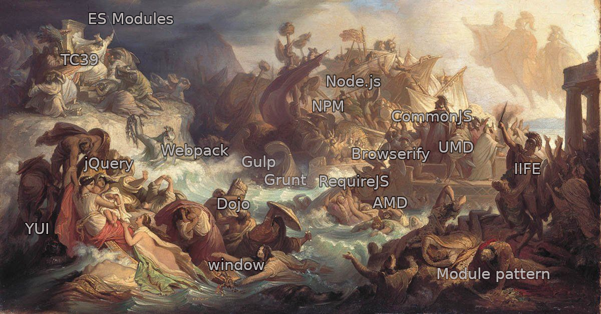

# Breve historia de los sistemas de módulos en JavaScript

## Índice

* [Preámbulo](#)
* [¿Por qué módulos?](#)
* [1991-1995: Prehistoria](#)
* [1995-2001: 1era guerra de los browsers](#)
  - [Ejemplo: Global party](#)
* [2001-2006: La era oscura](#)
* [2006-2009: En busca de la luz (jQuery, YUI, Dojo...)](#)
  - [Ejemplo: Clausuras e IIFEs](#)
  - [Ejemplo: jQuery plugin?](#)
* [2009-2015: Nuevas fronteras (Node.js, NPM, CommonJS, Require.js, AMD, UMD, ...)](#)
  - [Ejemplo: AMD, CommonJS, UMD](#)
  - [Ejemplo: Node.js y NPM](#)
* [2015-presente: Consolidación (ES6+, Webpack, Babel, ES Modules)](#)
  - [Ejemplo: Bundlers (webpack)](#)
  - [ES Modules](#)
* [Cronología](#)

***

## Preámbulo

**JavaScript**, como lenguaje de programación, es conocido por tener una barrera
de entrada relativamente baja, dado su carácter dinámico y laxo. Al mismo tiempo
es un lenguaje que **esconde un montón de _quirks_ y cosas raras producto de una
historia cuanto menos peculiar**.

## ¿Por qué módulos?

* Separación de responsabilidades
* Encapsulación (scope, namespaces)
* Reuso
* Arquitectura
* Colaboración (ecosistema)

## 1991-1995: Prehistoria

Ninguna historia se origina de la nada. Antes de embarcarnos en este viaje a
través de la evolución de la _idea_ de _modularidad_ en JavaScript, me gustaría
primero presentar a la _web_, y en particular al _navegador_ web, que es el
entorno donde nacerá después nuestro estimado _JavaScript_.

Tim Berners-Lee, inventor de la web (no confundir con la internet), construyó el
primer navegador web, así como el primer servidor web en CERN, Suiza. Comienza
el trabajo sobre la web (WorldWideWeb) como proyecto personal alrededor de 1989,
pero es en 2001 cuando lo presenta al mundo, ya como un proyecto bajo el
paraguas de CERN. Este es el nacimiento de la plataforma web, y la primera
descripción de `HTTP` y `HTML` entre otras _piezas fundamentales_ del _stack_ al
que hoy en día estamos tan acostumbrados.

En paralelo, en el año 2001 ocurren otros 2 eventos que junto a la web cambiarán
el destino de la computación como la conocemos hoy, nada más y nada menos que
el nacimiento de _Linux_ y _Python_.

La web fue concebida desde un inicio como un proyecto/recurso abierto. Solo un
año más tarde, en 1992, Tim Berners-Lee ya había hecho disponible la librería
`libwww`, que sería el punto de partida para el desarrollo de la primera
generación de navegadores web para UNIX, como Line Mode, Viola y otros.

1993: Mosaic (NCSA), Lynx, ...

1994: SpyGlass, W3C, Netscape Navigator

## 1995-2001: 1era guerra de los browsers

El año 1995 es un punto de inflexión en la evolución de la web. Por un lado,
el gobierno de EEUU deja de financiar parte de la infraestructura de la internet
y esta queda por primera vez totalmente privatizada. La internet y la web dejan
de ser algo limitado al mundo académico, de la investigación y militar, y
comienzan a estar disponibles también para el público en general.

En este contexto, ese mismo año AOL y Prodigy comienzan a ofrecer conexión a
internet en EEUU.

Durante el transcurso de 1995 verán la luz no solo JavaScript, sino también PHP,
Ruby y Java.

* **Netscape vs Internet Explorer**
* Win95 (Plus!)

> "First browser war ended with Internet Explorer having no remaining serious
> competition for its market share. This also brought an end to the rapid
> innovation in web browsers; until 2006, there was only one new version of
> Internet Explorer since the version 6.0 release in 2001."
> https://en.m.wikipedia.org/wiki/Browser_wars

> Like HTML 2, HTML 3 did not become a standard. HTML 3.2 was the first
> formally approved, industry-wide HTML standard, a W3C "Recommendation."
>
> Source: http://www.martinrinehart.com/frontend-engineering/engineers/html/html-tag-history.html

> The `<SCRIPT>` tag was "reserved for future use with scripting languages."
> It was one of the `<HEAD>` elements.

## 2001-2006: La era oscura

Terminada la guerra de los browsers, entramos a un período dominado por Internet
Explorer y un estancamiento en el desarrollo del stack web.

## 2006-2009: En busca de la luz

Desde mi punto de vista, 2006 representa un momento en el tiempo en el que la
incipiente _comunidad de usuarios_ de JavaScript comienza a encontrar su
identidad, su _estilo_, y finalmente comenzamos a soñar con un futuro mejor;
todo esto en gran parte a `jQuery` y `YUI`.

## 2009-2015: Nuevas fronteras

> "The CommonJS group defined a module format to solve JavaScript scope issues
> by making sure each module is executed in its namespace. This is achieved by
> forcing modules to explicitly export those variables it wants to expose to
> the “universe,” and also by defining those other modules required to
> properly work."
> — Webpack Docs

## 2015-presente: Consolidación

...

***

## Cronología

### 1991

* Nace la **WWW**. 1er navegador y servidor web de Tim Berners-Lee. (HTML, URL,
  HTTP, ...)
* Linux. Python.

### 1992

* [**libwww**](https://en.wikipedia.org/wiki/Libwww), https://github.com/w3c/libwww/commit/edb73538ebd51aa92e7bbebcad16d1f74ec093fb
* Unix browsers: Line Mode, Viola, ...

### 1993

* **Mosaic** (NCSA)
* Lynx, ...

### 1994

* Mayo: SpyGlass licencia código de Mosaic.
* 1 octubre: Formación de [**W3C**](https://en.wikipedia.org/wiki/World_Wide_Web_Consortium).
* 15 diciembre: Sale [**Netscape Navigator**](https://en.wikipedia.org/wiki/Netscape_Navigator). (Marc Andreessen ex-Mosaic engineer)

### 1995

* **Intenet totalmente privatizada** por 1era vez. No más financiación del
  gobierno de EEUU.
* **AOL** y Prodigy comienzan a ofrecer conexión a internet.
* **Internet Explorer** (basado en SpyGlass Mosaic)
* **JavaScript** (Brendan Eich, Netscape Navigator)
* Este año también aparecen PHP, Java y Ruby.

### 1996

* 17 diciembre: 1era versión de **CSS**.

### 1997

* 14 enero: Publicación de **HTML 3.2**. Etiqueta `<SCRIPT>` formalmente
  reservada para futuro uso de lenguajes scripting.
* Junio: Primera edición de [**ECMAScript**](https://en.wikipedia.org/wiki/ECMAScript).

### 1998

* Marzo: Netscape publica código fuente de Netscape Communicator y nace
  **Mozilla**.

### 1999

* Marzo: `XmlHttpRequest`

### 2002

* 23 septiembre: 1er release de **FireFox**.

### 2004

* 4 junio: Formación de [**WHATWG**](https://whatwg.org/)

### 2005

* Marzo: 1er release de [**Dojo**](https://dojotoolkit.org/).

### 2006

* 25 enero: 1er plugin de [**jQuery**](https://jquery.com/)
* 25 febrero: 1er release público de [**YUI**](https://clarle.github.io/yui3/) (`YUI.use()`)
* 26 agosto: 1er release de [**jQuery**](https://jquery.com/) (John Resig)

### 2007

* Blog post de Eric Miraglia (de YUI): _Module Pattern in JavaScript_.
* 7 marzo: 1er release de [**MooTools**](https://mootools.net/).

### 2008

* Mayo: Publicación de _JavaScript: The good parts_ de Douglas Crockford.
* 2 septiembre: 1er release público de **Google Chrome**.

### 2009

* Enero: Kevin Dangoor, ingeniero de Mozilla, comienza [**CommonJS**](https://en.wikipedia.org/wiki/CommonJS).
* 24/25 abril: 1era [JSConf US](http://2009.jsconf.us/)
* 1 julio: 1er release de [Modernizr](https://modernizr.com/)
* 27 mayo: 1er release [**Node.js**](https://nodejs.org/).
* 28 octubre: 1er release de [**Underscore.js**](http://underscorejs.org/).
* 7/8 noviembre: 1era [JSConf EU](https://www.jsconf.eu/2009/speakers.html)

### 2010

* 19 febrero: 1er release público de [**Require.js**](https://requirejs.org/) (0.8.0)
* 12 marzo: Blog post de Ben Cherry: [_JavaScript Module pattern in-depht_](http://www.adequatelygood.com/JavaScript-Module-Pattern-In-Depth.html).
* 1 junio: Blog post de Alex Sexton: [_How, When, And Why Script Loaders Are Appropriate_](https://docs.microsoft.com/en-us/previous-versions/msdn10/hh227261(v=msdn.10))
* 13 octubre: 1er release de [**Backbone.js**](http://backbonejs.org/).
* 20 octubre: 1er release de [**AngularJS**](https://angularjs.org/)
* 15 noviembre: Blog post the Ben Alman: [_Immediately-Invoked Function Expression (IIFE)_](http://benalman.com/news/2010/11/immediately-invoked-function-expression/), https://gist.github.com/cowboy/4710214
* 16 noviembre: 1er release de [**Express.js**](http://expressjs.com/)

### 2011

* 6 marzo: [_Using JavaScript closures to create private scopes_](https://lupomontero.com/using-javascript-closures-to-create-private-scopes)
* 27 marzo: [_A first look at the upcoming JavaScript modules_](https://2ality.com/2011/03/first-look-at-upcoming-javascript.html)
* 9 junio: 1er release de [**Browserify**](http://browserify.org/)
* 4 octubre: https://gist.github.com/jrburke/1262861
* 6/7 octubre: Alex Russell presenta [**Web Components** en Fronteers Conference](https://fronteers.nl/congres/2011/sessions/web-components-and-model-driven-views-alex-russell)
  por 1era vez.
* 18 octubre: [**Require.js**](https://requirejs.org/) 1.0.0
* 21 octubre: [**UMD (Universal Module Definition)**](https://github.com/umdjs/umd)
* 27 octubre: **Dojo** 1.7.0 introduce [**AMD**](https://en.wikipedia.org/wiki/Asynchronous_module_definition) a Dojo.
* 8 Dic: 1er release de [**Ember.js**](https://emberjs.com/)

### 2012

* 12 enero: Grunt 0.1.0
* Blog post de Addy Osmani: [_Writing Modular JavaScript With AMD, CommonJS & ES Harmony_](https://addyosmani.com/writing-modular-js/)

### 2013

* 29 mayo: 1er release de [**React**](https://reactjs.org/).
* 4 julio: Gulp 0.0.1

### 2014

* 19 febrero: 1er release de [**Webpack**](https://webpack.js.org/)
* febrero: 1er release de [**Vue.js**](https://vuejs.org/)
* 28 octubre: **HTML5**

### 2015

* **ES6 (aka ES2015)**.

### 2016

* 4 abril: [**Grunt**](http://gruntjs.com/) 1.0.0.
* Aparece soporte (experimental) de _dynamic imports_ en Babel/Webpack.

### 2018

* 28 marzo: Blog post de Lin Clark: [_ES modules: A cartoon deep-dive_](https://hacks.mozilla.org/2018/03/es-modules-a-cartoon-deep-dive/)
* Mayo: Firefox 60 introduce soporte para **ES Modules** y desde este momento
  todos los navegadores _de uso masivo_ cuentan con soporte nativo para ES
  Modules.

### 2019

* Abril: [Memorandum of Understanding Between W3C and WHATWG](https://www.w3.org/2019/04/WHATWG-W3C-MOU.html)

***

https://developer.mozilla.org/en-US/docs/Web/JavaScript/Guide/Modules